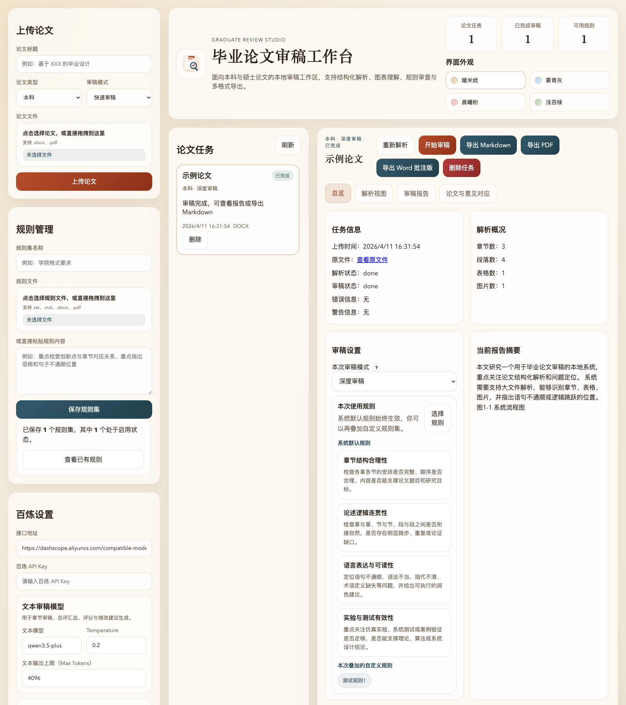
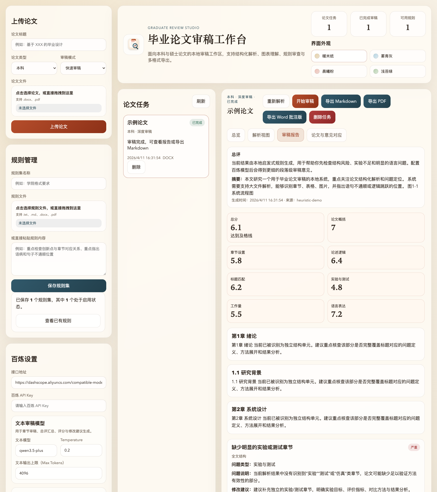
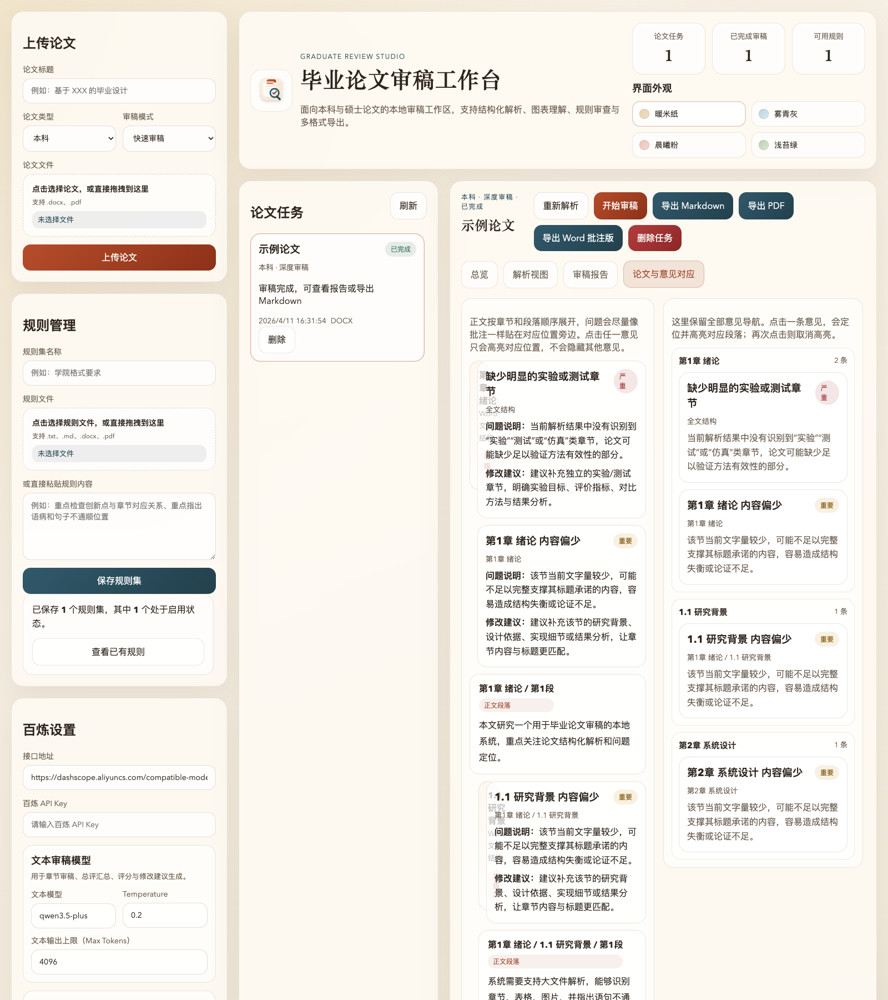

# 毕业论文审稿工作台

<p align="center">
  
</p>

<p align="center">
  面向本科与硕士论文的本地审稿辅助系统。<br />
  支持论文解析、图表理解、规则叠加、百炼审稿，以及 Markdown / PDF / Word 批注版导出。
</p>

<p align="center">
  欢迎使用，欢迎提交 <strong>Issues</strong> 和 <strong>Pull Requests</strong>。
</p>

## 项目简介

这个项目的目标不是把整篇论文直接丢给大模型“问一句”，而是先把论文拆成更适合模型理解和定位的问题结构，再结合系统默认规则与用户自定义规则，生成更细粒度、更可追踪的审稿意见。

它重点解决以下问题：

- 论文篇幅长，直接投喂大模型成本高、稳定性差
- 审稿意见容易空泛，缺少明确位置、原文证据和修改建议
- 导师、学院、答辩小组经常有自己的审查要求，需要叠加到统一流程里
- 图表、章节、段落之间的对应关系，传统摘要式问答很难处理好

因此，这个项目采用了“解析优先、结构化优先、定位优先”的设计思路。

## 核心能力

- 上传 `docx` / `pdf` 毕业论文
- 自动解析章节、节、小节、段落结构
- 单独抽取表格、图片及其上下文信息
- 对图片内容做独立理解
- 支持学院要求、导师关注点等自定义规则集
- 调用阿里云百炼平台进行快速审稿 / 深度审稿
- 输出总分、分项分数、重点问题、原文证据、润色建议
- 支持“论文内容 - 审稿意见”对应查看
- 支持 Markdown / PDF 审稿报告导出
- 支持 Word 批注版论文导出
- 支持任务状态追踪、失败定位、日志调试、任务删除

## 使用流程

```text
上传论文
  -> 文档解析
  -> 章节 / 段落 / 表格 / 图片结构化存储
  -> 叠加系统默认规则与用户规则
  -> 百炼图片理解
  -> 百炼分章节审稿
  -> 百炼总评汇总
  -> 页面查看 / Markdown / PDF / Word 导出
```

## 页面能力

### 1. 上传论文

- 选择论文标题、论文类型、审稿模式
- 支持点击选择文件，也支持拖拽上传
- 当前支持 `docx` 与非扫描版 `pdf`

### 2. 规则管理

- 上传规则文件或直接粘贴规则文本
- 保存为可复用规则集
- 查看已有规则
- 启用 / 停用 / 删除规则
- 审稿时按需叠加到系统默认规则

### 3. 百炼设置

- 配置百炼兼容接口地址
- 配置 API Key
- 分别配置文本审稿模型与图片理解模型
- 分别配置文本输出上限与图片输出上限
- 配置图片理解数量上限
- 配置导出内容模块

### 4. 论文任务

- 查看任务状态
- 重新解析
- 重新审稿
- 删除测试任务
- 切换界面外观主题

### 5. 审稿结果

- 总览
- 解析视图
- 审稿报告
- 论文与意见对应视图
- Markdown / PDF / Word 批注版导出

## 页面截图

### 工作台总览



### 审稿报告



### 论文与意见对应



## 审稿输出内容

系统会尽量从以下维度给出结果：

- 论文主要内容概括
- 各章设置是否合理
- 各节叙述逻辑是否顺畅
- 标题与内容是否匹配
- 技术动机、合理性与论证完整性
- 章与章、节与节、段与段之间是否连贯
- 实验 / 测试 / 仿真是否足以支撑结论
- 整体工作量是否达标
- 总分与各维度分项评分
- 对于硕士论文，提炼创新点并评估创新点与章节对应关系

问题项会尽量附带：

- 问题标题
- 严重程度
- 问题类型
- 位置标签
- 原文证据
- 问题分析
- 修改建议
- 润色建议

## 技术栈

### 后端

- `FastAPI`
- 本地 JSON 持久化
- 异步任务调度
- `httpx` 调用百炼兼容接口

### 文档解析

- `python-docx` 解析 Word
- `PyMuPDF` 解析 PDF 与图片
- `pdfplumber` 提取表格

### 前端

- 原生 HTML / CSS / JavaScript
- 单页式本地工作台界面

### 审稿输出

- 分章节结构化输出
- 总评汇总结构化输出
- Word 批注版导出

## 目录结构

```text
.
├── app.py
├── requirements.txt
├── graduate_review/
│   ├── jobs.py
│   ├── llm.py
│   ├── review.py
│   ├── storage.py
│   ├── rules.py
│   └── parsers/
├── static/
│   ├── index.html
│   ├── styles.css
│   ├── app.js
│   └── logo.svg
├── docs/
│   └── screenshots/
└── data/
```

运行后主要数据会落在：

- `data/papers/`：原论文、解析结果、审稿结果、图片资源
- `data/rules/`：规则集
- `data/exports/`：Markdown / PDF / Word 导出结果
- `data/settings.json`：本地配置

## 本地启动

### 1. 安装依赖

```bash
python3 -m pip install -r requirements.txt --target .deps
```

### 2. 启动服务

```bash
PYTHONPATH=.deps python3 -m uvicorn app:app --host 127.0.0.1 --port 8000 --reload
```

### 3. 打开浏览器

```text
http://127.0.0.1:8000
```

### 4. Python 版本注意事项

安装 `.deps` 和启动服务时，必须使用同一个 Python 版本。  
如果 `.deps` 是用 Python `3.10` 装出来的，却用 Python `3.12` 启动，就可能出现 `pydantic_core` 之类的二进制兼容错误。

如果遇到这类问题，可以这样重新安装：

```bash
rm -rf .deps
python3 -m pip install -r requirements.txt --target .deps
PYTHONPATH=.deps python3 -m uvicorn app:app --host 127.0.0.1 --port 8000 --reload
```

## 百炼配置建议

建议在页面左侧填写：

- 接口地址：
  - `https://dashscope.aliyuncs.com/compatible-mode/v1`
- 百炼 API Key
- 文本模型：
  - 例如 `qwen3.5-plus`
- 视觉模型：
  - 例如 `qwen3-vl-plus`
- 文本输出上限：
  - 建议从 `4096` 或 `8192` 开始
- 图片输出上限：
  - 建议从 `512` 或 `1024` 开始
- 图片理解数量上限：
  - 调试阶段建议先设置为 `5` 或 `8`

## 调试日志

当前版本会在终端输出比较详细的过程日志，便于判断到底卡在哪一步。

你可以看到：

- 任务入队日志
- 解析开始 / 结束日志
- 审稿步骤日志
- 百炼请求开始 / 结束日志
- 图片解析成功 / 失败日志
- 章节审稿结果预览
- 总评结果预览

如果模型确实有返回，终端会出现类似：

```text
===== 百炼输出预览开始 model=qwen3.5-plus =====
...
===== 百炼输出预览结束 model=qwen3.5-plus =====
```

## 当前限制

- 当前仅支持非扫描版 PDF，不做 OCR
- PDF 的复杂跨页表格、复杂图文排版仍可能需要人工复核
- 论文结构切分依赖标题样式、编号和文本块推断，极端排版下可能误判
- 图片较多时，视觉模型调用会明显增加总耗时
- 当前是本地单用户版本，不包含多账号和线上部署能力

## 欢迎使用与参与贡献

欢迎你直接使用这个项目，也欢迎你把它用于：

- 毕设过程中的自检
- 导师初筛论文
- 答辩前的问题排查
- 学院内部审查规则工具化
- AI + 教育场景的项目演示与产品化验证

如果你在使用过程中发现问题，或想一起把它做得更好，欢迎：

- 提交 `Issue`
- 提交 `Pull Request`
- 提出新的审稿维度、导出模板或交互建议

如果你准备提 Issue，建议尽量附上：

- 使用的论文格式：`docx` / `pdf`
- 审稿模式：快速 / 深度
- 是否配置了百炼模型
- 复现步骤
- 错误日志或截图

如果你准备提 Pull Request，建议：

- 先开一个 Issue 说明改动目标
- 改动尽量聚焦在一个主题
- 补充必要的说明或验证方式

## License

